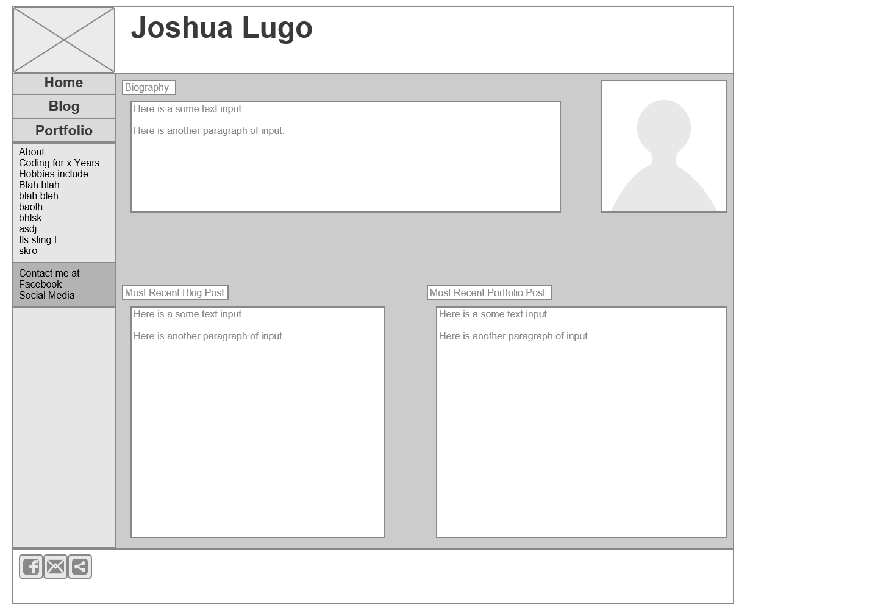
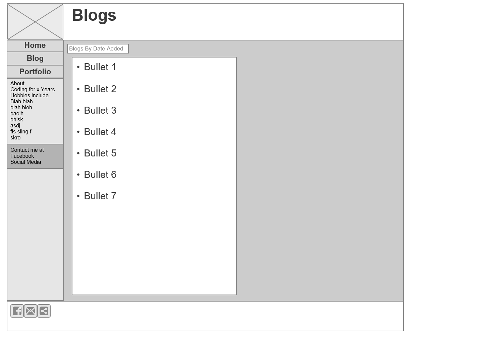

What is a wireframe?

A wireframe is a mock website design.  Can be drawn on paper or using wireframe tools.

What are the benefits of wireframing?

They can be used as a reference point for building html and css elements.  Especially useful for making sure semantic elements are used, since you have the general layout you intend to use.

Did you enjoy wireframing your site?

Yes and no.  I felt sort of bogged down by the multitude of tools and lack of streamlined interface.  But that's more to do with the online wireframe tool I used.

Did you revise your wireframe or stick with your first idea?

I did minor revisions but I stuck with the same general idea the whole way through.

What questions did you ask during this challenge? What resources did you find to help you answer them?

I didn't have any questions.  It was a pretty straightforward assignment to complete.

Which parts of the challenge did you enjoy and which parts did you find tedious?

I enjoy the idea that we will create something out of this, but I'm frustrated that it's not right now! I am just eager to get the ball rolling faster is all.