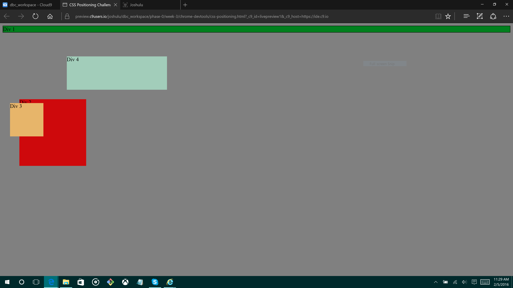
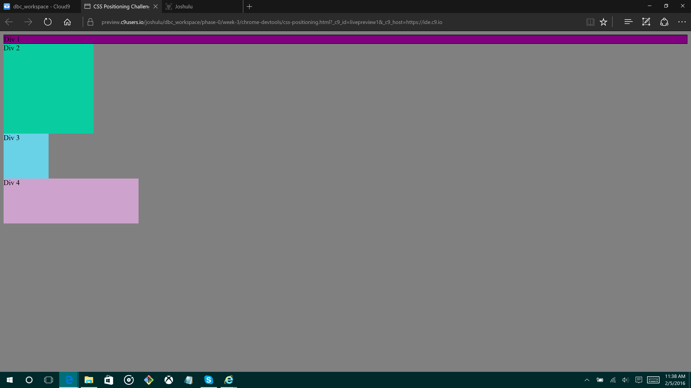
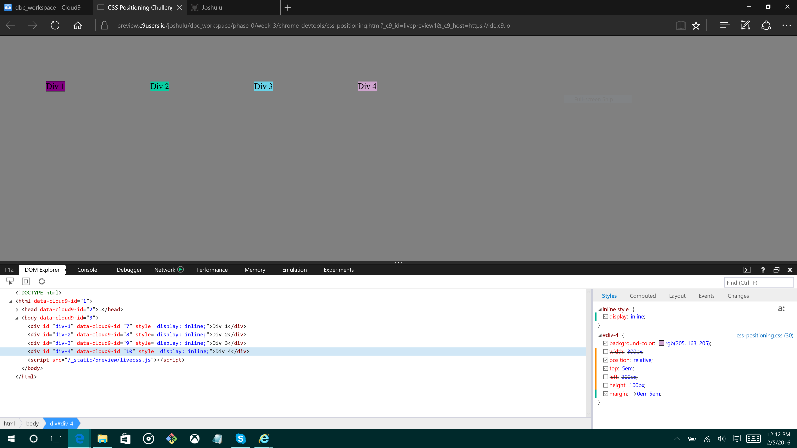
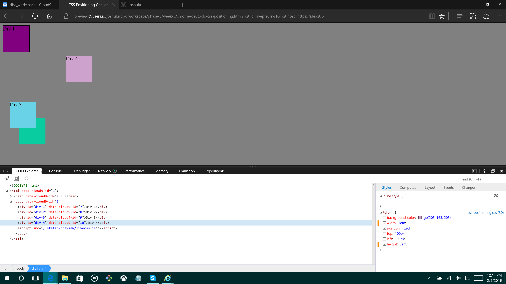
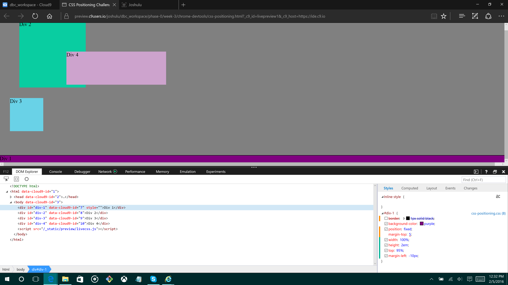
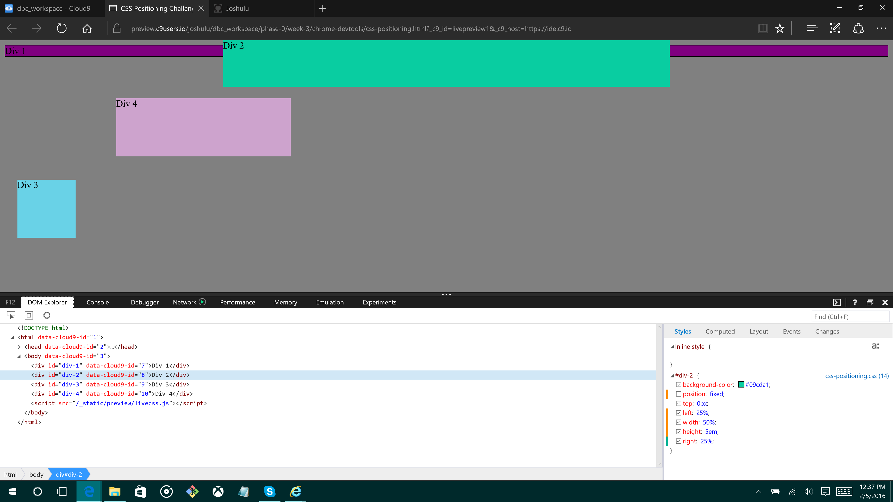
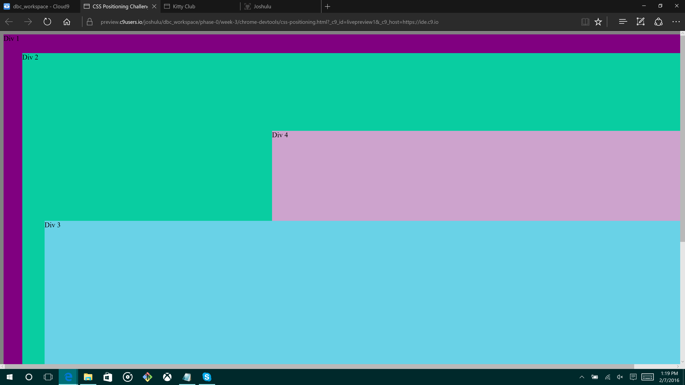

-How can you use Chrome's DevTools inspector to help you format or position elements?

Personally, I used Microsoft Edge's DevTools.  It was almost exactly the same.  You can select objects on screen and it will take you to where that is in the html and css.  You can edit in real time to see what sort of values change on screen.

-How can you resize elements on the DOM using CSS?

Resizing involves making sure the object can be modified.  After you do that you can directly change its height and width as pixels, percents or em units.

-What are the differences between absolute, fixed, static, and relative positioning?  Which did you find easiest to use?  Which was most difficult?

Absolute: I didn't understand this one, so I had to research it a bit.  It makes more sense to me if this was relative, but an absolute element is sort of nested around it's closest positioned element.  Since static is default, it is not considered positioned.

Fixed: makes an object stay on the page, regardless of scrolling, in whatever location you decide

Static: this is the default value of html elements.  You can't use top, bottom, left or right CSS properties on static objects.

Relative: you can use top, bottom, right and left on relative elements.  From what I understand, this is relative to its static position.

-What are the differences between margin, border, and padding?

A margin is the space between outside elements and the border.  The border is simply a line/box around the element.  Padding is the space between the border and whatever content you put inside the element.

-What was your impression of this challenge overall? (love, hate, and why?)

I didn't really care for this challenge.  I like the experimentation and learning I got from it, but the challenge itself seemed lackluster and not fit for a pair challenge.  There are not a lot of ways to position the elements accordingly, and having a driver and navigator felt burdening on both of us.  SZometimes we could feed off each others' ideas.  But mostly, it felt like I was just doing what the instructions said to do.

