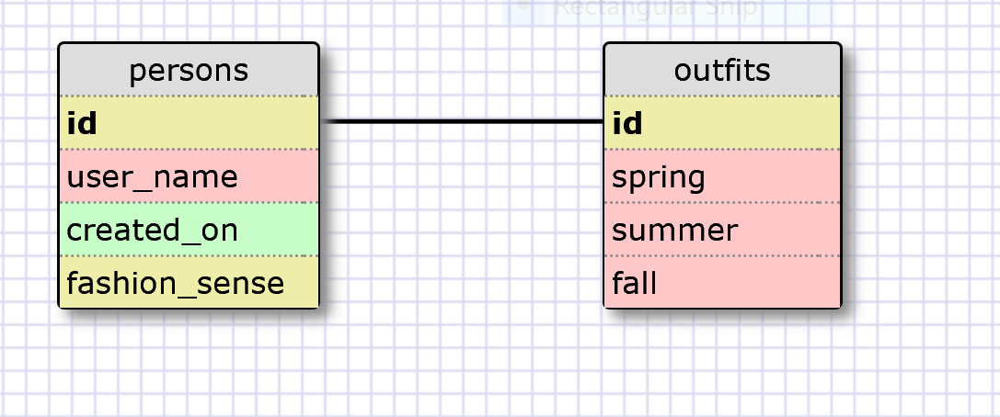

RELEASE 5:

1. SELECT * FROM states;

-

2. SELECT * FROM regions;

-

3. SELECT state_name, population FROM states;

-

4. SELECT state_name, population FROM states

   ORDER BY population DESC;
   
-

5. SELECT state_name FROM states

   WHERE region_id == 7;
   
-

6. SELECT state_name, population_density FROM states
   
   WHERE population_density > 50

   ORDER BY population_density ASC;

-

7. SELECT state_name FROM states
   
   WHERE population > 1000000 AND population < 1500000;

-

8. SELECT state_name, region_id FROM states
   
   ORDER BY region_id ASC;

-

9. SELECT region_name FROM regions

   WHERE region_name LIKE '%central%';

-

10. SELECT region_name, state_name

    FROM states
    
    INNER JOIN regions
    
    ON states.region_id=regions.id

    ORDER BY region_id ASC;

RELEASE 6:

-

-

RELEASE 7: REFLECTION

•What are databases for?

Storing information.  Typically lots of information.

-

•What is a one-to-many relationship?

A one-to-many relationship would be where in one table you have a column of x.

And on the other table, you have a column of y where several y values have an x value.

Your one x value has several y values.

-

•What is a primary key? What is a foreign key? How can you determine which is which?

A primary key is a unique identifier, commonly an integer id.  No table may have more

than one primary key.  A foreign key is similar, except that it points to a primary

key in another table.  This is a way that tables interact and share information.

-

•How can you select information out of a SQL database? What are some general guidelines for that?

They have a specific key-word for that.  Using SELECT, you can choose the information you

want to access.  SELECT column_name FROM table_name;  You would see column_name in

table_name.  Other ways to access data from tables include using the dot operator.

Table_name.column_name accesses the column_name column from the Table_name table.

